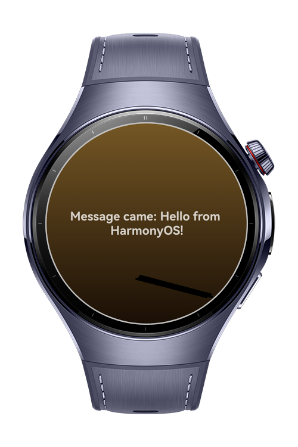

> **Note:** To access all shared projects, get information about environment setup, and view other guides, please visit [Explore-In-HMOS-Wearable Index](https://github.com/Explore-In-HMOS-Wearable/hmos-index).

# How To Use Web Socket

The WebSocketCodelab page provides a simple environment to test and explore WebSocket functionality. It allows developers to simulate real-time communication between the client and server, send and receive messages, and observe connection states.

# Preview

<div>
  
</div>

# Use Cases

This module is ideal for verifying WebSocket integration, debugging message flow, and understanding how live data streams can be managed within HarmonyOS applications.

# Tech Stack

- **Languages**: ArkTS, Typescript
- **Frameworks**: HarmonyOS SDK 5.1.0(18)
- **Tools**: DevEco Studio Vers 5.1.0.842
- **Libraries**: @kit.BasicServicesKit, @kit.NetworkKit

# Directory Structure

```entry/src/main/ets/
|---entryability
| |---EntryAbility.ets
|---entrybackupability
| |---EntryBackupAbility.ets  
|---pages
| |---Index.ets
|---services
| |---WebSocketService.ets
```

# Constraints and Restrictions
## Supported Devices
- Huawei Watch 5

# LICENSE

WebSocketCodelab is distributed under the terms of the MIT License.
See the [LICENSE](/LICENSE) for more information.
